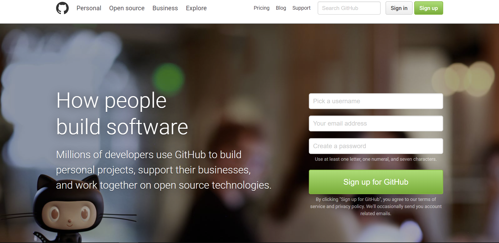
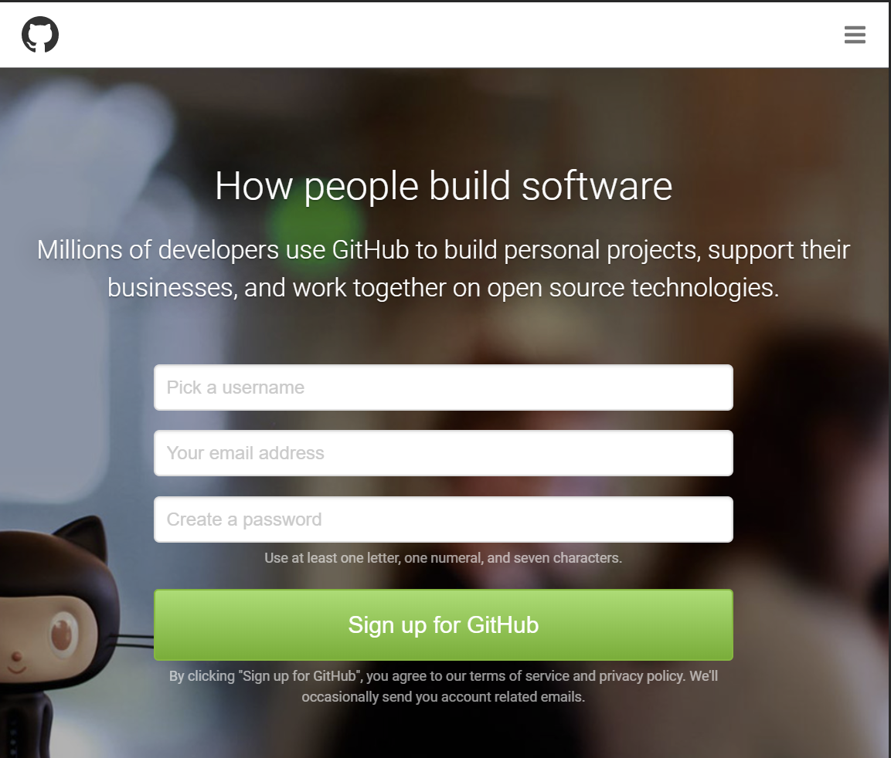

# GitHub main page

GitHub 사이트의 메인 페이지를 반응형으로 작업합니다.

- 미디어쿼리를 이용한 반응형 웹
- Semantic Tag준수
- BEM방식 class 네이밍.

## Multi Device
미디어 쿼리를 이용한 멀티 디바이스 지원.

### Media(Grid) options

| 종류 | 디바이스 | 단위(px) |
|:---:|:---:|:---:|
| Large Devices | Desktops | 1024px 이상 |
| Medium Devices | Tablets | 1024px 이하 |
| Small Devices | Tablets + Phones | 768px 이하 |

### Desktop

### Tablet

### Mobile

